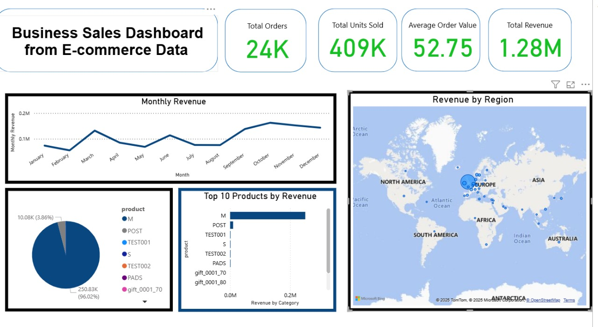

# Business Sales Dashboard -- E-commerce Data

## 📌 Project Overview

This project analyzes e-commerce sales data and builds an interactive
**Power BI dashboard** to track business performance. The dashboard
provides insights into total orders, revenue, product performance, and
geographical distribution.

## 📂 Files

-   **Dataset:** [Download the "Online Retail II" dataset from
    Kaggle](https://www.kaggle.com/datasets/mashlyn/online-retail-ii-uci)\
-   **Power BI file:** `task-1.pbix` -- Power BI dashboard file.\
-   **Screenshot:** `task.jpg` -- Visual preview of the dashboard.

## 📊 Dashboard Features

1.  **KPIs (Cards):**
    -   Total Orders: **24K**\
    -   Total Units Sold: **409K**\
    -   Average Order Value: **52.75**\
    -   Total Revenue: **1.28M**
2.  **Visuals:**
    -   **Monthly Revenue Trend** -- Line chart showing revenue over
        time.\
    -   **Revenue by Region** -- Map visualization highlighting sales
        across regions.\
    -   **Top 10 Products by Revenue** -- Bar chart ranking
        top-performing products.\
    -   **Product Share** -- Pie chart showing revenue contribution by
        product category.

## 📑 Dataset Description

The "Online Retail II" dataset contains transactional data from a
UK-based online retail company, spanning from December 1, 2009 to
September 12, 2011. It includes the following columns:

-   **InvoiceNo** -- Unique invoice number (cancellations flagged with a
    'C').\
-   **StockCode** -- Product code.\
-   **Description** -- Product description.\
-   **Quantity** -- Quantity of items per transaction.\
-   **InvoiceDate** -- Date and time of transaction.\
-   **UnitPrice** -- Price per unit (in GBP).\
-   **CustomerID** -- Unique identifier for each customer.\
-   **Country** -- Country of the customer.

## 🚀 How to Use

1.  Visit the Kaggle link to download the dataset.\
2.  Save the downloaded `online_retail_II.xlsx` alongside `task-1.pbix`
    and `task.jpg`.\
3.  Open **Power BI Desktop**.\
4.  Load `task-1.pbix`. If necessary, refresh the data source to link to
    `online_retail_II.xlsx`.\
5.  Explore the dashboard: apply filters, drill into visuals, and derive
    insights.

## 📷 Dashboard Preview

